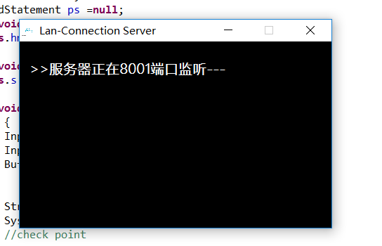
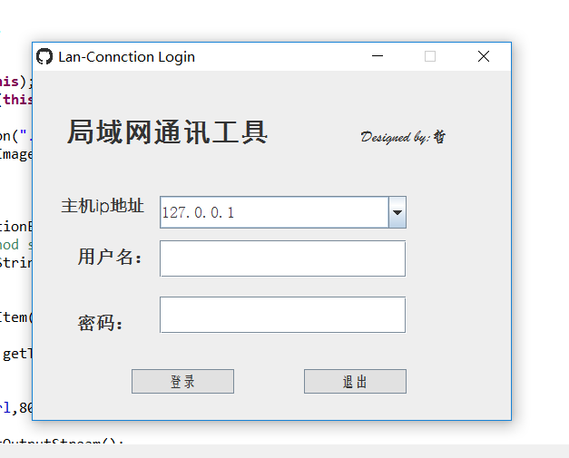
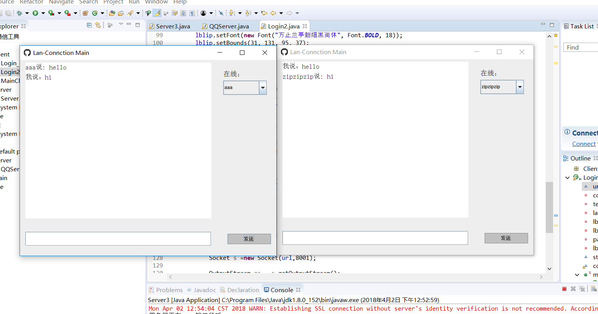

Lan-Connection
==============

一款基于socket的局域网通信工具
------------------
效果图：

----------

----------

----------

 - 概述：服务器监控8001端口，将客户端的socket放进一个hashmap中，实现所有客户端的链接与信息交互
 - 实现功能：
不同客户端在线时相互感知对方的存在，并能通过选择信息接收方从而实现通讯。
 - 注意事项
   1.首先开启服务端，监听8001端口后，再开启客户端登录界面Login2.java正常使用。
   2.登录以及密码已经在数据库中存好，**具体的数据库信息设置自行在server.java中设置即可**。我在目的位置已经标明。

 

